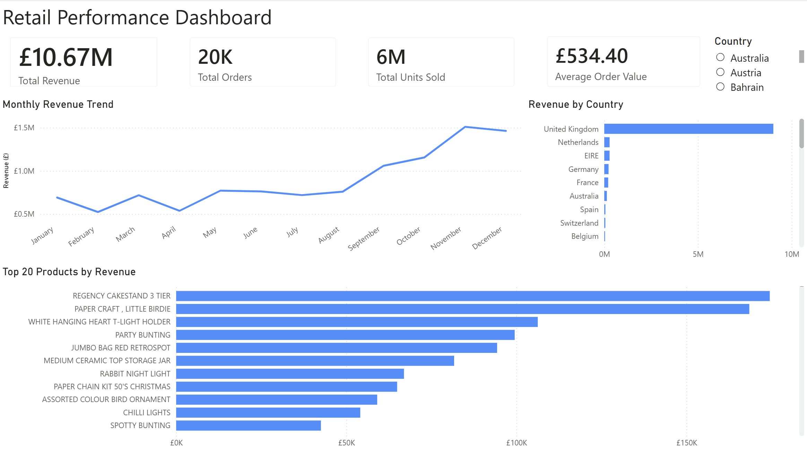
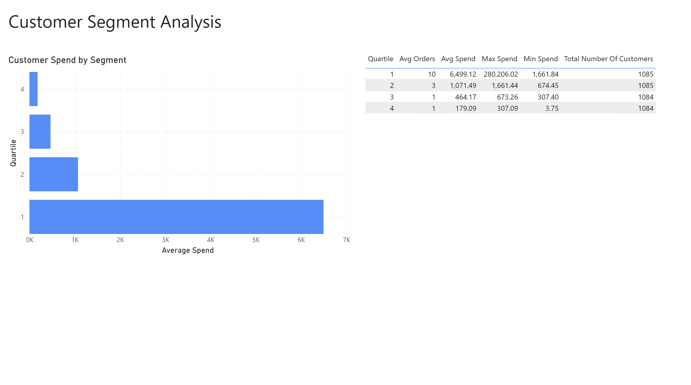
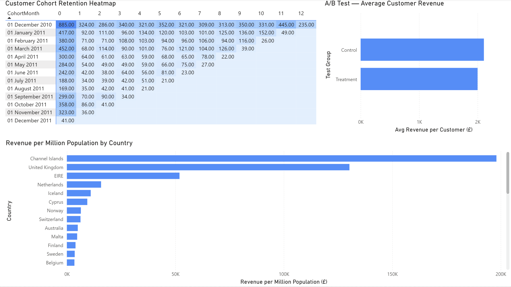

# Retail BI Dashboard — End-to-End Analytics Project

An end-to-end Business Intelligence and analytics project built on real UK retail transaction data. Covers the full data pipeline from raw data cleaning through to interactive Power BI dashboards, with SQL analytics including cohort analysis, customer segmentation, A/B test simulation, and JSON data enrichment.

Built as a portfolio project targeting Data Analyst, BI Developer, and Customer Analytics roles in the UK market.

---

## Dashboard Screenshots

### Executive Overview


### Customer Segment Analysis


### Customer & Marketing Analytics


---

## Project Overview

| Item | Detail |
|------|--------|
| **Dataset** | UCI Online Retail — UK online retailer, Dec 2010 – Dec 2011 |
| **Raw rows** | 541,909 transactions |
| **Clean rows** | 530,104 after cleaning |
| **Total revenue** | £10,666,684 |
| **Countries** | 38 |
| **Unique customers** | 4,338 (with CustomerID) |

---

## Tech Stack

| Tool | Purpose |
|------|---------|
| **Python** (pandas, sqlalchemy, requests) | Data cleaning, loading, JSON ingestion |
| **SQL Server 2025 Express** | Data storage and transformation |
| **SSMS 22** | Query development and view creation |
| **Power BI Desktop** | Data modelling and dashboard |
| **Git / GitHub** | Version control and portfolio |

---

## Project Structure

- **data/** — Raw and clean data files (excluded from Git)
- **scripts/** — Python cleaning notebook, SQL views, cohort analysis notebook
- **docs/** — Dashboard screenshots
- **PROGRESS.md** — Step by step build log
- **README.md** — Project documentation

---

## Data Pipeline

```
Raw Excel File (541,909 rows)
        |
        v  [Python — clean_data_steps.ipynb]
Clean CSV (530,104 rows)
        |
        v  [Python — sqlalchemy]
SQL Server — RetailDW database
        |
        v  [SQL — SSMS]
SQL Views (8 pre-aggregated views)
        |
        v  [Power BI — Import mode]
Interactive Dashboard (3 pages)
```

---

## SQL Views

| View | Description |
|------|-------------|
| `vw_monthly_revenue` | Monthly revenue, orders, and units sold by country |
| `vw_top_products` | Top products by revenue, with country breakdown |
| `vw_revenue_by_country` | Revenue, orders, and unique customers by country |
| `vw_dim_country` | Country dimension table for star schema |
| `vw_customer_segments` | Customer spend quartiles using NTILE() window function |
| `vw_cohort_analysis` | Customer retention by acquisition cohort — 3 chained CTEs |
| `vw_ab_test_summary` | A/B test campaign simulation — control vs treatment comparison |
| `vw_country_enriched_sales` | Retail sales joined to JSON API data — revenue per million population |

---

## Dashboard Pages

### Page 1 — Executive Overview
- **KPI cards** — Total Revenue (£10.67M), Total Orders (20K), Total Units Sold (6M), Average Order Value (£534)
- **Monthly Revenue Trend** — line chart showing clear Q4 seasonality peak in November 2011
- **Top 20 Products by Revenue** — horizontal bar chart, DOTCOM POSTAGE filtered out
- **Revenue by Country** — UK dominates; Netherlands and EIRE are top international markets
- **Country slicer** — filters all visuals via star schema relationships

### Page 2 — Customer Segment Analysis
- **Customer Spend by Segment** — bar chart showing spend distribution across 4 quartiles
- **Segment detail table** — avg spend, min/max spend, avg orders per quartile
- Key insight: top 25% of customers average £6,499 spend vs £179 for bottom 25%

### Page 3 — Customer & Marketing Analytics
- **Cohort Retention Heatmap** — matrix showing retention of 13 acquisition cohorts over 12 months
- **A/B Test Simulation** — control vs treatment group average revenue comparison
- **Revenue per Million Population** — JSON-enriched country analysis normalised by population

---

## Key SQL Techniques

- **CTEs (Common Table Expressions)** — chained CTEs for cohort analysis pipeline
- **Window functions** — NTILE(4) for customer segmentation, DATEDIFF for cohort month calculation
- **DATEFROMPARTS** — rounding dates to first of month for consistent cohort grouping
- **Subqueries** — inline views for multi-step transformations
- **Star schema** — dimension table (vw_dim_country) enabling cross-filtering in Power BI
- **JSON ingestion** — REST API data parsed with Python and loaded into SQL Server

---

## Key Findings

- Total revenue of £10,666,684 across 530,000+ transactions
- Strong Q4 seasonality — November 2011 peak month at £1,509,496
- United Kingdom accounts for the majority of revenue; Netherlands and EIRE are top international markets
- Channel Islands ranks highest for revenue per million population — small market, high spend per capita
- Top product: Regency Cakestand 3 Tier
- Top 25% of customers (by spend) average £6,499 vs £179 for bottom 25%
- December 2010 cohort — largest cohort, 885 customers acquired, 235 still active at month 12

---

## Data Cleaning Steps

1. Removed 1,454 rows with missing product descriptions
2. Removed 9,288 cancelled transactions (InvoiceNo starting with 'C')
3. Removed 474 negative quantity rows
4. Removed 589 zero/negative price rows
5. Standardised descriptions to uppercase and trimmed whitespace
6. Converted InvoiceDate to datetime
7. Added TotalAmount calculated column (Quantity × UnitPrice)
8. Final dataset: 530,104 rows, 9 columns

---

## Certifications

- [Microsoft Certified: Power BI Data Analyst Associate (2026)](https://learn.microsoft.com/api/credentials/share/en-us/RTonmoy-9502/EB6F4345EC12AB55?sharingId=E40DB118463467CE)
- [Excel Skills for Data Analytics and Visualization — Macquarie University (2023)](https://coursera.org/verify/specialization/SQUXTDBPCWXF)